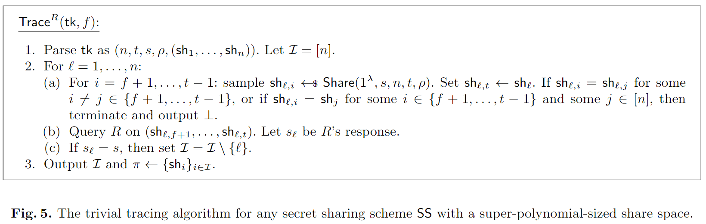

<!-- _class: lead gaia -->

# Traceable Secret Sharing: Strong Security and Efficient Constructions

Dan Boneh, Aditi Partap, and Lior Rotem
Stanford University

Crypto 2024

---

# 总览
1. 应用场景
2. 可追踪的秘密共享
3. 基于Shamir秘密分享
4. 讨论和外来方向
5. A Simple Tracing Algorithm
---
# 1. 应用场景

假设 Alice 使用 $t$-out-of-$n$ 的秘密共享方案将她的密钥存储在 $n$ 个服务器上。只要这 $n$ 个服务器中有 $t$ 个没有串通，她的密钥就会受到保护。然而，如果有少于 $t$ 个服务器决定出售它们持有的共享怎么办？在这种情况下，Alice 应该能够追责这些服务器，否则将无法阻止它们出售共享。

---

因此，我们需要一种秘密共享方案满足以下两个保证：
1. **可追踪性（Traceability）**  
	首先，如果 Alice 获得了泄露的信息，她应该能够将其追踪回泄露的服务器。此外，为了追究这些服务器的责任，她还应该能够提供一个证明，表明这些服务器确实泄露了她的秘密信息。
	
2. **非可归责性（Non-Imputability）**  
	第二个需求是**非可归责性**。这一性质要求 Alice 不应该能够伪造一份虚假的证明，以诬陷任何未参与泄露的诚实服务器。

---
# 2. 可追踪的秘密共享

可追踪的秘密共享方案是一个包含四个PPT（概率多项式时间）算法的四元组
$$\text{TTSS} = (\text{Share}, \text{Rec}, \text{Trace}, \text{Verify})$$
我们现在更详细地定义可追踪秘密共享方案的语法：
- $\text{Share}(1^\lambda, s, n, t, \rho) \rightarrow (sh_i, tk_i, vk_i)$：这是共享算法。它的输入包括安全参数$1^\lambda$、秘密$s$、参与方的数量$n$、阈值$t \leq n$，以及一个相关字符串$\rho \in \{0, 1\}^\kappa$（其中$\kappa = \kappa(\lambda, n, t) \in \mathbb{N}$）。==**该算法的输出包括一个共享$sh_i$、一个追踪密钥成分$tk_i$和一个验证密钥成分$vk_i$。**==

---

- $\text{Rec}(\{sh_{i_1}, \ldots, sh_{i_t}\}) \rightarrow s$： 这是确定性的秘密重构算法。它的输入是$t$个秘密共享$sh_{i_1}, \ldots, sh_{i_t}$，输出秘密$s$。我们强调，这个重构算法并不假设具有关于输入的共享来源的外部知识，因为该方案是对称的，所有共享来自同一分布。为了简化表示，我们有时也可以写作$\text{Rec}(sh_{i_1}, \ldots, sh_{i_t})$。
- $\text{Trace}_R(tk, 1/\delta) \rightarrow (I, \pi)$：这是随机化的追踪算法。它的输入包括一个追踪密钥$tk = (tk_1, \ldots, tk_n)$和一个误差参数$\delta$，并对重构箱$R$具有黑盒访问权限。**该算法输出一个泄露参与方的子集$I \subseteq [n]$以及一个相关的证明$\pi$。**
- $\text{Verify}(vk, I, \pi) \rightarrow \{0, 1\}$：这是确定性的验证算法。它的输入包括验证密钥$vk = (vk_1, \ldots, vk_n)$、一个被指控为泄露者的子集$I$以及一个相关的证明$\pi$，输出值为 1 表示接受证明，即证明$I$中的各方有罪，输出 0 则表示拒绝该证明。

---
##  普遍良好的良好重构箱：

设 TTSS 是一个可追溯的秘密共享方案。令 $\lambda \in \mathbb{N}$，$n, t, f \in \mathbb{N}$ 且 $0 < f < t \leq n$，以及 $\kappa = \kappa(\lambda, n, t)$。对于 $\epsilon \in [0, 1]$，$f$ 份分享 $sh = (sh_1, \ldots, sh_f)$，和子集 $C \subseteq \{0, 1\}^\kappa$，我们称重建盒 $R$ 为 $(n, t, sh, C, \epsilon)$-良好的，如果

$$\Pr \left[ R(sh'_1, \ldots, sh'_{t-f}) = Rec(sh_1, \ldots, sh_f, sh'_1, \ldots, sh'_{t-f}) \right] \geq \epsilon$$

其中概率是对 $sh'_i \gets SH_{\lambda, n, t}(C)$（对于 $i = 1, \ldots, t-f$）和重建盒 $R$ 的随机硬币的取样概率。

----

##  普遍可追溯性

令 $TTSS = (Share, Rec, Trace, Verify)$ 是一个具有秘密空间 $SCRT = \{SCRT_\lambda\}_{\lambda \in \mathbb{N}}$ 的可追溯秘密共享方案，$\epsilon = \epsilon(\lambda)$ 是安全参数的一个函数，$\Gamma$ 是相关性字符串空间 $\{0, 1\}^\kappa$ 的一个划分。我们说 $TTSS$ 满足**普遍可追溯性**，如果对于每一个概率多项式时间的对手 $A$，以下函数在 $\lambda$ 上是可忽略的：

$$Adv^{\text{uni-trac}}_{A, TTSS, \Gamma, \epsilon(\lambda)} :=| \Pr[\text{ExpUniTrace}_{A, TTSS, \Gamma, \epsilon(\lambda)} = 1] - \frac{1}{|SCRT_\lambda|}|。$$

**如果一个可追溯秘密共享方案（例如本文中构造的那些方案）满足普遍可追溯性（定义 5.2），那么它也满足标准可追溯性（定义 5.1），并且参数是相关的。**

---

----

# 3. Shamir可追踪秘密共享

## 3.1 随机评估点

对手可能会破坏一部分随机的参与方集合 $I$，并利用集合 $I$ 中的秘密分享构造一个重建盒 $R$。设 $f = |I|$。当 $R$ 接收到来自 $I$ 之外的 $t-f$ 个参与方的分享时，它会输出秘密 $s$；但同时，$R$ 可以将其输入的分享 $(x_i, q(x_i))$ 与参与方 $i$ 关联起来，因为 $x_i$ 是参与方索引 $i$ 的确定性函数。

每个 $x_i$ 是从域 $F$ 中均匀随机采样的，则分享 $(x_i, q(x_i))$ 无法在未知经销商随机性的情况下直接关联到参与方 $i$。

---

## 3.2 通过多项式插值和因式分解进行追踪

为简单起见，假设损坏的份额数量为 $f = t-1$。假设 $R$ 中硬编码的份额是 $(x_i, y_i = q(x_i))$，其中 $i = 1, \ldots, t-1$。当给 $R$ 一个额外的形式为 $(x_t, y_t)$ 的份额时，$R$ 需要输出：

$$s = \sum_{i \in [t]} \left( \prod_{k \in [t] \setminus \{i\}} \frac{x_k}{x_k - x_i} \right) \cdot y_i$$

否则，$R$ 就不是一个良好的重建盒。该公式可以重新写成：

$$s = \sum_{i \in [t-1]} \left( \prod_{k \in [t] \setminus \{i\}} \frac{x_k}{x_k - x_i} \right) \cdot y_i + \left( \prod_{k \in [t-1]} \frac{x_k}{x_k - x_t} \right) \cdot y_t \tag{1}$$

---
如果我们将形式为 $(x_t, y_t + 1)$ 的份额提供给 $R$，其中 $x_t$ 和 $y_t$ 保持不变，则得到另一个 $s'$ 满足：

$$s' = \sum_{i \in [t-1]} \left( \prod_{k \in [t] \setminus \{i\}} \frac{x_k}{x_k - x_i} \right) \cdot y_i + \left( \prod_{k \in [t-1]} \frac{x_k}{x_k - x_t} \right) \cdot (y_t + 1) \tag{2}$$

将公式 (1) 从公式 (2) 中相减并重排，得到：

$$\prod_{k \in [t-1]} \frac{x_k - x_t}{x_k} = (s' - s)^{-1} \tag{3}$$

---
- 考虑单变量多项式 $h(X) = \prod_{k \in [t-1]} \frac{x_k - X}{x_k}$，其变量为 $X$。可以观察到，$h$ 的根正是被损坏参与方的 $x_i$ 值。
- 可以将公式 (3) 解释为 $h$ 在点 $x_t$ 的评估值。
- 通过重复上述过程，对 $R$ 进行额外 $t-1$ 次新的 $x_t$ 值查询，可以获得 $h$ 的 $t$ 个评估值。
- 由于 $h$ 是一个 $t-1$ 次多项式，这些评估值足够通过插值重建 $h$ 并因式分解以找到其根。
- 如果追踪器 $tk$ 包含所有参与方的真实 $x_i$ 值，则可以将 $h$ 的根追踪回被损坏的参与方。

---

## 3.3 追踪不完美重构盒
- 重构盒 $R$ 的输出不一定正确
	- 重构盒只能以某种非可忽略的概率输出正确的重构秘

- 从带有错误的评估点集合中插值出一个有界度数的多项式的问题等价于 Reed-Solomon 码的列表解码问题。
	- 给定一组评估点 $\{(x'_j , z_j )\}$，列表解码算法会输出所有符合特定评估点比例的多项式的列表。

---

**定义 10 (RS 列表解码问题)** 令 $F$ 是一个有限域，$k, N, C \in \mathbb{N}$，且满足 $C \leq N < |F|$。列表解码问题定义如下：给定 $k$、$C$ 和 $N$ 对元素 $\{(x_i, y_i)\}_{i\in[N]} \subseteq F^2$，输出所有与至少 $C$ 对 $(x_i, y_i)$ 相符的、最多为 $k$ 次的单变量多项式的列表 $H$。具体来说：

$$H = \{h \in F[X] : \deg(h) \leq k \ \wedge \ |\{j \in [N] : h(x_j ) = y_j\}| \geq C \}$$

- 在黑盒的方式中使用 Reed-Solomon 码的列表解码;
- 在定理 1 中考虑了经典的 Guruswami-Sudan 列表解码算法;
- 任何能够在多项式时间内解决定义 10 中的 Reed-Solomon 列表解码问题的算法也都可以使用。

---
## 3.4 追踪算法

---

### 定理 2
对于任意对手 $A$，对于任意 $\lambda \in \mathbb{N}$，对于任意 $N, C \in \mathbb{N}$ 和 $\epsilon \in (2(N + f + t^2)p, 1)$，且满足 $\epsilon > \frac{p^2 C}{N}$ 以及 $\sqrt{f N} \leq C \leq N < p$，有：

$$Adv^{\text{uni-trac}}_{A,TS,\epsilon}(\lambda) \leq e^{-\epsilon^2 N^2 \cdot (1 - \frac{1}{r})^2} + f \cdot n \cdot \tau / p$$
其中：
- $p = |F|$；
- $r = \frac{\epsilon^2 N^2}{C}$；
- $n = n(\lambda)$，$f = f(\lambda)$ 分别是参与方数量和腐败数量的上界；
- $\tau = \tau(N, f, \log p)$ 是 Guruswami-Sudan 算法输出长度的多项式上界。

---

## 3.5 增加不可归责性
- 由于追踪密钥 $tk$ 明确包含了 $x_1, \ldots, x_n$，这使得恶意追踪者可以通过将某个 $x_i$ 包含在证明 $\pi$ 中，错误地指控任意一个参与方 $i$。
- 为了解决这个问题，我们需要**预先隐藏**这些 $x_i$，但同时又使得追踪者（以及后来的验证者）可以将从重构盒 $R$ 中提取的 $x_i$ 关联回原参与方 $i$。

---
### 3.5.1 共享算法的更改
共享算法 Share($1^\lambda, s, n, t, \rho$) 现在也计算 $u_i \gets F(x_i)$，其中 $F$ 是一个**单向函数**。追踪密钥成分 $tk_i$ 和验证密钥成分 $vk_i$ 设为 $tk_i = vk_i = u_i$（而不是原来的 $x_i$）。

---
### 3.5.2 追踪算法的更改   

- 追踪算法 Trace 计算多项式列表 $H = \{h_j\}_j$ 与之前相同。
- 对于每一个 $j$，Trace 现在通过对 $h_j$ 进行因式分解来找到它的根 $w_1, \ldots, w_f$，并检查 $h_j$ 是否为正确的多项式。
- 然后，对于每个 $i \in [f]$，计算 $u'_i \gets F(w_i)$，并在追踪密钥 $tk$ 中查找 $u'_i$。如果对于某个索引 $i \in [f]$，$u'_i$ 没有出现在追踪密钥 $tk$ 中，那么 Trace 就从列表 $H$ 中移除 $h_j$。
- 假设在这个过程结束时，列表 $H$ 中至少剩下一个多项式。设 $h^*$ 为列表 $H$ 中的第一个多项式，其根为 $w^*_1, \ldots, w^*_f$。对于每个 $i \in [f]$，Trace 找到索引 $k \in [n]$，使得 $F(w^*_i) = u_k$，并将 $k$ 加入到腐败方子集 $I$ 中。    - 证明 $\pi$ 被设置为 $(w^*_1, \ldots, w^*_f)$。
---
### 3.5.2 验证算法的更改

要验证一个证明 $\pi = \{w_1, \ldots, w_f\}$ 是否与子集 $I = \{i_1, \ldots, i_f\}$ 一致，验证算法 Verify 检查对于 $j \in [f]$，$F(w_j) = u_{i_j}$，其中验证密钥为 $vk = (u_1, \ldots, u_n)$。

**将该方案记作 NITS（代表“不可归责的可追踪 Shamir”，即 "Non-Imputable Traceable Shamir"）。**

---

# 4. 讨论与未来方向
## 4.1 追踪其他秘密共享方案
- 基于中国剩余定理（CRT）的Asmuth-Bloom秘密共享方案;
- 在本工作之后，Hoffmann[44]为Mignotte基于CRT的秘密共享方案的一个变体提出了追踪方法;
- 然而，该方案仅提供了较弱的保密性，因为秘密是整个CRT编码的信息字（而不仅仅是Asmuth-Bloom秘密共享方案中某个编码字坐标）;
- 无论如何，解决Asmuth-Bloom秘密共享方案中的泄露追踪问题仍是一个有趣的开放问题

---

## 4.2 可追踪的阈值VUF
- 阈值可验证不可预测函数（VUF）最近在区块链中的应用变得非常重要。多年来，已有几种阈值VUF的构造被提出。
- 其中一种最高效的构造基于双线性群上的BLS签名，其中签名密钥通过Shamir秘密共享在n个评估者之间分配。
- 在即将进行的工作中，我们构造了一种具有线性重建和线性或二次追踪的可追踪秘密共享方案。这样的可追踪秘密共享方案将立即产生一种基于BLS的可追踪阈值VUF。

---

## 4.3 与擦除码的联系

- 许多研究观察到了秘密共享与擦除码之间的紧密联系（例如，[50, 19, 23, 24, 2]）。- 一个t-out-of-n的阈值秘密共享方案可以直接转化为一个词长为n的擦除码，该擦除码可以容忍最多n-t个擦除错误。一个词w的编码是其n个秘密共享的连接（共享算法使用固定的随机性）。秘密共享方案的正确性保证了高效解码。
- 从这一视角来看，一个引人入胜的开放问题是设计针对其他从擦除码获得的秘密共享方案的追踪方法。特别感兴趣的是基于低密度奇偶校验码（LDPC码）的秘密共享方案[2, 23]。

---

# 5. A Simple Tracing Algorithm

---

<!-- _class: lead gaia -->

# 感谢聆听