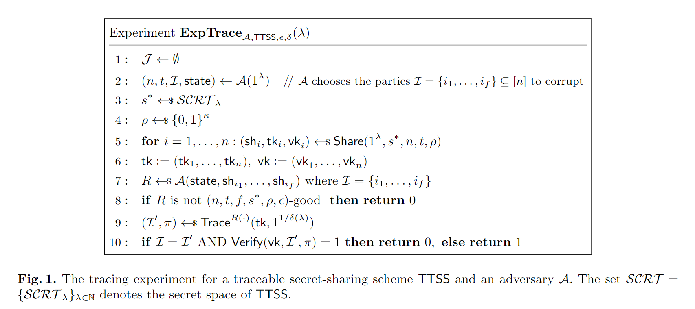
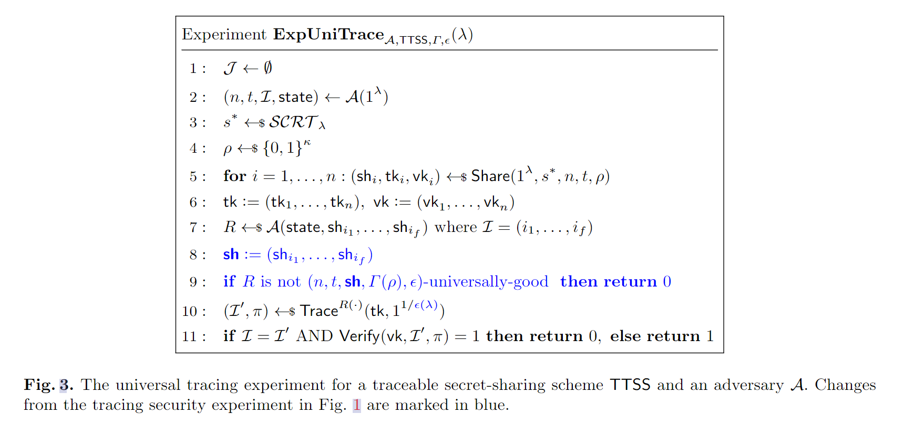
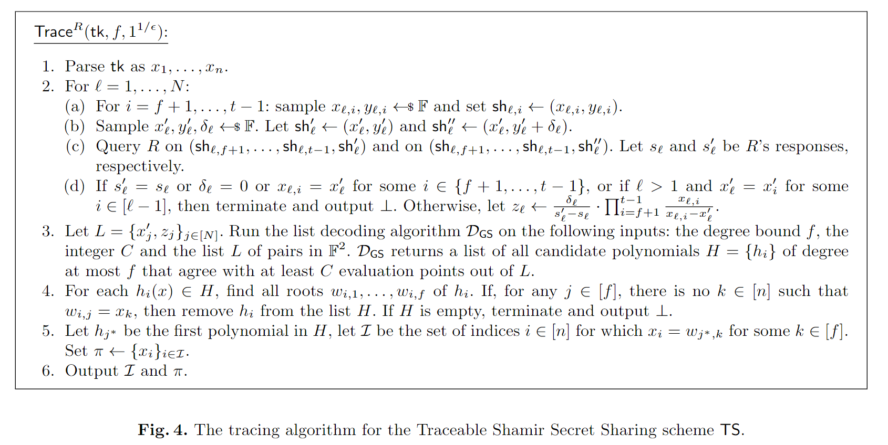
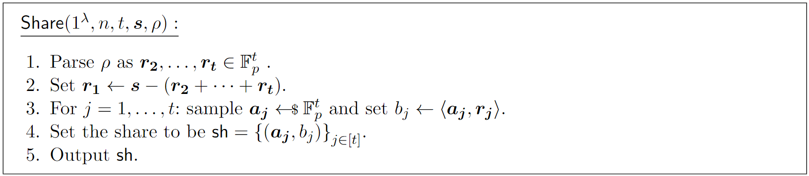
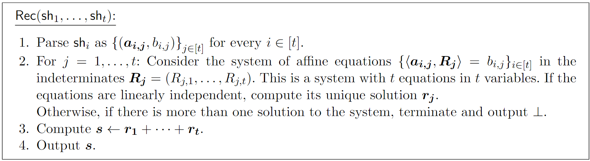
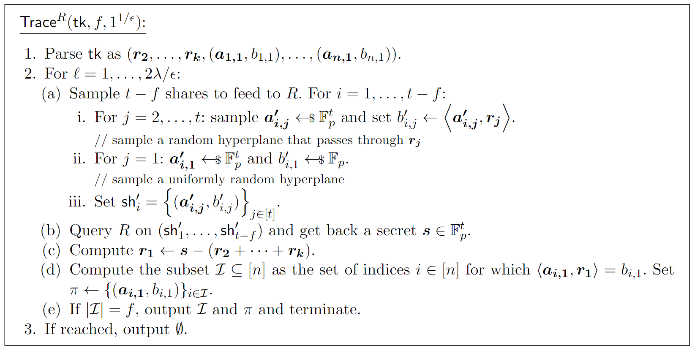
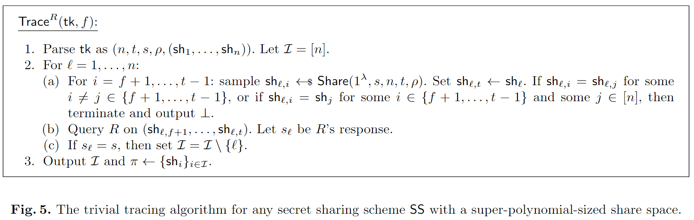

<!-- _class: lead gaia -->

# Traceable Secret Sharing: Strong Security and Efficient Constructions

Dan Boneh, Aditi Partap, and Lior Rotem
Stanford University

Crypto 2024

---

# 总览
1. 应用场景
2. 可追踪的秘密共享
3. 基于Shamir秘密分享
4. Blakley 秘密共享
5. Blakley 可追踪秘密共享
6. 讨论和外来方向
7. A Simple Tracing Algorithm
---
# 1. 应用场景

假设 Alice 使用 $t$-out-of-$n$ 的秘密共享方案将她的密钥存储在 $n$ 个服务器上。只要这 $n$ 个服务器中有 $t$ 个没有串通，她的密钥就会受到保护。然而，如果有少于 $t$ 个服务器决定出售它们持有的共享怎么办？在这种情况下，Alice 应该能够追责这些服务器，否则将无法阻止它们出售共享。

---

因此，我们需要一种秘密共享方案满足以下两个保证：
1. **可追踪性（Traceability）**  
	首先，如果 Alice 获得了泄露的信息，她应该能够将其追踪回泄露的服务器。此外，为了追究这些服务器的责任，她还应该能够提供一个证明，表明这些服务器确实泄露了她的秘密信息。
	
2. **非可归责性（Non-Imputability）**  
	第二个需求是**非可归责性**。这一性质要求 Alice 不应该能够伪造一份虚假的证明，以诬陷任何未参与泄露的诚实服务器。

---
# 2. 可追踪的秘密共享

可追踪的秘密共享方案是一个包含四个PPT（概率多项式时间）算法的四元组
$$\text{TTSS} = (\text{Share}, \text{Rec}, \text{Trace}, \text{Verify})$$
我们现在更详细地定义可追踪秘密共享方案的语法：
- $\text{Share}(1^\lambda, s, n, t, \rho) \rightarrow (sh_i, tk_i, vk_i)$：这是共享算法。它的输入包括安全参数$1^\lambda$、秘密$s$、参与方的数量$n$、阈值$t \leq n$，以及一个相关字符串$\rho \in \{0, 1\}^\kappa$（其中$\kappa = \kappa(\lambda, n, t) \in \mathbb{N}$）。==**该算法的输出包括一个共享$sh_i$、一个追踪密钥成分$tk_i$和一个验证密钥成分$vk_i$。**==

---

- $\text{Rec}(\{sh_{i_1}, \ldots, sh_{i_t}\}) \rightarrow s$： 这是确定性的秘密重构算法。它的输入是$t$个秘密共享$sh_{i_1}, \ldots, sh_{i_t}$，输出秘密$s$。我们强调，这个重构算法并不假设具有关于输入的共享来源的外部知识，因为该方案是对称的，所有共享来自同一分布。为了简化表示，我们有时也可以写作$\text{Rec}(sh_{i_1}, \ldots, sh_{i_t})$。
- $\text{Trace}_R(tk, 1/\delta) \rightarrow (I, \pi)$：这是随机化的追踪算法。它的输入包括一个追踪密钥$tk = (tk_1, \ldots, tk_n)$和一个误差参数$\delta$，并对重构箱$R$具有黑盒访问权限。**该算法输出一个泄露参与方的子集$I \subseteq [n]$以及一个相关的证明$\pi$。**
- $\text{Verify}(vk, I, \pi) \rightarrow \{0, 1\}$：这是确定性的验证算法。它的输入包括验证密钥$vk = (vk_1, \ldots, vk_n)$、一个被指控为泄露者的子集$I$以及一个相关的证明$\pi$，输出值为 1 表示接受证明，即证明$I$中的各方有罪，输出 0 则表示拒绝该证明。

---

## 性质
-  2.1 **正确性**：任何$t$个共享的组合应该足以正确重构出秘密。
- 2.2 **秘密性**：少于任何$t$个共享的组合不应该重构出秘密。
- 2.3 **追踪者的秘密性**：少于任何$t$个共享和追踪秘钥的组合不应该重构出秘密。

---

## 2.4.1 良好重构箱：
设$\text{TTSS}$是一个可追踪秘密共享方案。设$\lambda \in \mathbb{N}$，$n, t, f \in \mathbb{N}$满足$0 < f < t \leq n$，并设$\kappa = \kappa(\lambda, n, t)$。对于$\epsilon \in [0, 1]$、一个秘密$s^*$和相关字符串$\rho \in \{0, 1\}^\kappa$，我们称重构箱$R$是一个$(n, t, f, s^*, \rho, \epsilon)$-良好重构箱，如果满足以下条件：

$$
\Pr \left[ R(sh'_1, \ldots, sh'_{t - f}) = s^* \right] \geq \epsilon,
$$

其中概率是从$(sh'_i, tk'_i, vk_i) \leftarrow \text{Share}(1^\lambda, s^*, n, t, \rho)$（对于$i = 1, \ldots, t - f$）以及$R$的随机过程取的。

---

## 2.4.2 普遍良好的良好重构箱：

设 TTSS 是一个可追溯的秘密共享方案。令 $\lambda \in \mathbb{N}$，$n, t, f \in \mathbb{N}$ 且 $0 < f < t \leq n$，以及 $\kappa = \kappa(\lambda, n, t)$。对于 $\epsilon \in [0, 1]$，$f$ 份分享 $sh = (sh_1, \ldots, sh_f)$，和子集 $C \subseteq \{0, 1\}^\kappa$，我们称重建盒 $R$ 为 $(n, t, sh, C, \epsilon)$-良好的，如果

$$\Pr \left[ R(sh'_1, \ldots, sh'_{t-f}) = Rec(sh_1, \ldots, sh_f, sh'_1, \ldots, sh'_{t-f}) \right] \geq \epsilon$$

其中概率是对 $sh'_i \gets SH_{\lambda, n, t}(C)$（对于 $i = 1, \ldots, t-f$）和重建盒 $R$ 的随机硬币的取样概率。

---

##  2.5.1 可追踪性

设$\text{TTSS} = (\text{Share}, \text{Rec}, \text{Trace}, \text{Verify})$是一个可追踪秘密共享方案，其秘密空间为$\text{SCRT} = \{\text{SCRT}_\lambda\}_{\lambda \in \mathbb{N}}$，且$\epsilon = \epsilon(\lambda)$和$\delta = \delta(\lambda)$是安全参数的函数。我们称$\text{TTSS}$是可追踪的，如果对于任意概率多项式时间对手$A$，下列函数在$\lambda$上是可忽略的：
$$\mathrm{Adv}_{\mathcal{A},\text{TTSS},\epsilon,\delta}^{\mathrm{trac}}(\lambda):=\left|\epsilon\cdot\mathrm{Pr}\left[\mathrm{ExpTrace}_{\mathcal{A},\text{TTSS},\epsilon,\delta}(\lambda)=1\right]-\frac{1}{|\mathcal{SCRT}_{\lambda}|}\right|$$

---

---

##  2.5.2普遍可追溯性

令 $TTSS = (Share, Rec, Trace, Verify)$ 是一个具有秘密空间 $SCRT = \{SCRT_\lambda\}_{\lambda \in \mathbb{N}}$ 的可追溯秘密共享方案，$\epsilon = \epsilon(\lambda)$ 是安全参数的一个函数，$\Gamma$ 是相关性字符串空间 $\{0, 1\}^\kappa$ 的一个划分。我们说 $TTSS$ 满足**普遍可追溯性**，如果对于每一个概率多项式时间的对手 $A$，以下函数在 $\lambda$ 上是可忽略的：

$$Adv^{\text{uni-trac}}_{A, TTSS, \Gamma, \epsilon(\lambda)} :=| \Pr[\text{ExpUniTrace}_{A, TTSS, \Gamma, \epsilon(\lambda)} = 1] - \frac{1}{|SCRT_\lambda|}|。$$

**如果一个可追溯秘密共享方案（例如本文中构造的那些方案）满足普遍可追溯性（定义 5.2），那么它也满足标准可追溯性（定义 5.1），并且参数是相关的。**

---

----

# 3. Shamir可追踪秘密共享

## 3.1 随机评估点

对手可能会破坏一部分随机的参与方集合 $I$，并利用集合 $I$ 中的秘密分享构造一个重建盒 $R$。设 $f = |I|$。当 $R$ 接收到来自 $I$ 之外的 $t-f$ 个参与方的分享时，它会输出秘密 $s$；但同时，$R$ 可以将其输入的分享 $(x_i, q(x_i))$ 与参与方 $i$ 关联起来，因为 $x_i$ 是参与方索引 $i$ 的确定性函数。

每个 $x_i$ 是从域 $F$ 中均匀随机采样的，则分享 $(x_i, q(x_i))$ 无法在未知经销商随机性的情况下直接关联到参与方 $i$。

---

## 3.2 通过多项式插值和因式分解进行追踪

为简单起见，假设损坏的份额数量为 $f = t-1$。假设 $R$ 中硬编码的份额是 $(x_i, y_i = q(x_i))$，其中 $i = 1, \ldots, t-1$。当给 $R$ 一个额外的形式为 $(x_t, y_t)$ 的份额时，$R$ 需要输出：

$$s = \sum_{i \in [t]} \left( \prod_{k \in [t] \setminus \{i\}} \frac{x_k}{x_k - x_i} \right) \cdot y_i$$

否则，$R$ 就不是一个良好的重建盒。该公式可以重新写成：

$$s = \sum_{i \in [t-1]} \left( \prod_{k \in [t] \setminus \{i\}} \frac{x_k}{x_k - x_i} \right) \cdot y_i + \left( \prod_{k \in [t-1]} \frac{x_k}{x_k - x_t} \right) \cdot y_t \tag{1}$$

---
如果我们将形式为 $(x_t, y_t + 1)$ 的份额提供给 $R$，其中 $x_t$ 和 $y_t$ 保持不变，则得到另一个 $s'$ 满足：

$$s' = \sum_{i \in [t-1]} \left( \prod_{k \in [t] \setminus \{i\}} \frac{x_k}{x_k - x_i} \right) \cdot y_i + \left( \prod_{k \in [t-1]} \frac{x_k}{x_k - x_t} \right) \cdot (y_t + 1) \tag{2}$$

将公式 (1) 从公式 (2) 中相减并重排，得到：

$$\prod_{k \in [t-1]} \frac{x_k - x_t}{x_k} = (s' - s)^{-1} \tag{3}$$

---
- 考虑单变量多项式 $h(X) = \prod_{k \in [t-1]} \frac{x_k - X}{x_k}$，其变量为 $X$。可以观察到，$h$ 的根正是被损坏参与方的 $x_i$ 值。
- 可以将公式 (3) 解释为 $h$ 在点 $x_t$ 的评估值。
- 通过重复上述过程，对 $R$ 进行额外 $t-1$ 次新的 $x_t$ 值查询，可以获得 $h$ 的 $t$ 个评估值。
- 由于 $h$ 是一个 $t-1$ 次多项式，这些评估值足够通过插值重建 $h$ 并因式分解以找到其根。
- 如果追踪器 $tk$ 包含所有参与方的真实 $x_i$ 值，则可以将 $h$ 的根追踪回被损坏的参与方。

---

## 3.3 追踪不完美重构盒
- 重构盒 $R$ 的输出不一定正确
	- 重构盒只能以某种非可忽略的概率输出正确的重构秘

- 从带有错误的评估点集合中插值出一个有界度数的多项式的问题等价于 Reed-Solomon 码的列表解码问题。
	- 给定一组评估点 $\{(x'_j , z_j )\}$，列表解码算法会输出所有符合特定评估点比例的多项式的列表。

---

**定义 10 (RS 列表解码问题)** 令 $F$ 是一个有限域，$k, N, C \in \mathbb{N}$，且满足 $C \leq N < |F|$。列表解码问题定义如下：给定 $k$、$C$ 和 $N$ 对元素 $\{(x_i, y_i)\}_{i\in[N]} \subseteq F^2$，输出所有与至少 $C$ 对 $(x_i, y_i)$ 相符的、最多为 $k$ 次的单变量多项式的列表 $H$。具体来说：

$$H = \{h \in F[X] : \deg(h) \leq k \ \wedge \ |\{j \in [N] : h(x_j ) = y_j\}| \geq C \}$$

- 在黑盒的方式中使用 Reed-Solomon 码的列表解码;
- 在定理 1 中考虑了经典的 Guruswami-Sudan 列表解码算法;
- 任何能够在多项式时间内解决定义 10 中的 Reed-Solomon 列表解码问题的算法也都可以使用。

---
## 3.4 追踪算法

---

### 定理 2
对于任意对手 $A$，对于任意 $\lambda \in \mathbb{N}$，对于任意 $N, C \in \mathbb{N}$ 和 $\epsilon \in (2(N + f + t^2)p, 1)$，且满足 $\epsilon > \frac{p^2 C}{N}$ 以及 $\sqrt{f N} \leq C \leq N < p$，有：

$$Adv^{\text{uni-trac}}_{A,TS,\epsilon}(\lambda) \leq e^{-\epsilon^2 N^2 \cdot (1 - \frac{1}{r})^2} + f \cdot n \cdot \tau / p$$
其中：
- $p = |F|$；
- $r = \frac{\epsilon^2 N^2}{C}$；
- $n = n(\lambda)$，$f = f(\lambda)$ 分别是参与方数量和腐败数量的上界；
- $\tau = \tau(N, f, \log p)$ 是 Guruswami-Sudan 算法输出长度的多项式上界。

---

## 3.5 增加不可归责性
- 由于追踪密钥 $tk$ 明确包含了 $x_1, \ldots, x_n$，这使得恶意追踪者可以通过将某个 $x_i$ 包含在证明 $\pi$ 中，错误地指控任意一个参与方 $i$。
- 为了解决这个问题，我们需要**预先隐藏**这些 $x_i$，但同时又使得追踪者（以及后来的验证者）可以将从重构盒 $R$ 中提取的 $x_i$ 关联回原参与方 $i$。

---
### 3.5.1 共享算法的更改
共享算法 Share($1^\lambda, s, n, t, \rho$) 现在也计算 $u_i \gets F(x_i)$，其中 $F$ 是一个**单向函数**。追踪密钥成分 $tk_i$ 和验证密钥成分 $vk_i$ 设为 $tk_i = vk_i = u_i$（而不是原来的 $x_i$）。

---
### 3.5.2 追踪算法的更改   

- 追踪算法 Trace 计算多项式列表 $H = \{h_j\}_j$ 与之前相同。
- 对于每一个 $j$，Trace 现在通过对 $h_j$ 进行因式分解来找到它的根 $w_1, \ldots, w_f$，并检查 $h_j$ 是否为正确的多项式。
- 然后，对于每个 $i \in [f]$，计算 $u'_i \gets F(w_i)$，并在追踪密钥 $tk$ 中查找 $u'_i$。如果对于某个索引 $i \in [f]$，$u'_i$ 没有出现在追踪密钥 $tk$ 中，那么 Trace 就从列表 $H$ 中移除 $h_j$。
- 假设在这个过程结束时，列表 $H$ 中至少剩下一个多项式。设 $h^*$ 为列表 $H$ 中的第一个多项式，其根为 $w^*_1, \ldots, w^*_f$。对于每个 $i \in [f]$，Trace 找到索引 $k \in [n]$，使得 $F(w^*_i) = u_k$，并将 $k$ 加入到腐败方子集 $I$ 中。    - 证明 $\pi$ 被设置为 $(w^*_1, \ldots, w^*_f)$。
---
### 3.5.2 验证算法的更改

要验证一个证明 $\pi = \{w_1, \ldots, w_f\}$ 是否与子集 $I = \{i_1, \ldots, i_f\}$ 一致，验证算法 Verify 检查对于 $j \in [f]$，$F(w_j) = u_{i_j}$，其中验证密钥为 $vk = (u_1, \ldots, u_n)$。

**将该方案记作 NITS（代表“不可归责的可追踪 Shamir”，即 "Non-Imputable Traceable Shamir"）。**

---

# 4. Blakley秘密共享

## 4.1 原始Blakley秘密共享分发机制

设秘密为一个 $t$-维空间中的点 $S = (x_1, x_2, \dots, x_t)$，$S$ 是要共享的秘密点坐标。

1. **构造几何超平面**：
   - 在 $t$-维空间中，一个超平面可以表示为：
     $$a_1x_1 + a_2x_2 + \dots + a_tx_t = b$$
     其中 $a_1, a_2, \dots, a_t$ 是超平面的系数，$b$ 是常数项。
   - 选择 $n \geq t$ 个超平面，其中 $t$ 是门限值。每个超平面用一组随机的系数 $a_1, a_2, \dots, a_t$ 和常数项 $b$ 确定。

---

2. **分发超平面信息**：
   - 为每个参与者分配一个唯一的超平面方程。对于第 $i$ 个参与者，超平面方程为：
     $$a_1^{(i)}x_1 + a_2^{(i)}x_2 + \dots + a_t^{(i)}x_t = b_i$$
     这里 $a_1^{(i)}, a_2^{(i)}, \dots, a_t^{(i)}$ 和 $b_i$ 是随机生成的满足条件的值。
   - 每个参与者存储该超平面的所有系数和常数项，即 $(a_1^{(i)}, a_2^{(i)}, \dots, a_t^{(i)}, b_i)$。

---

## 4.2  原始Blakley秘密共享重构机制

当至少有 $t$ 个参与者时，可以通过他们的超平面方程恢复秘密点 $S$。

1. **超平面集合**：
   - 假设参与者集合为 $P = \{P_1, P_2, \dots, P_t\}$，他们各自持有超平面方程：
     $$a_1^{(1)}x_1 + a_2^{(1)}x_2 + \dots + a_t^{(1)}x_t = b_1$$
     $$a_1^{(2)}x_1 + a_2^{(2)}x_2 + \dots + a_t^{(2)}x_t = b_2$$
     $$\vdots$$
     $$a_1^{(t)}x_1 + a_2^{(t)}x_2 + \dots + a_t^{(t)}x_t = b_t$$

---
2. **线性方程组的求解**：
   - 将这些超平面方程看作一个线性方程组：
     $$\mathbf{A} \mathbf{x} = \mathbf{b}$$
     $$\mathbf{A} = 
     \begin{bmatrix}
     a_1^{(1)} & a_2^{(1)} & \dots & a_d^{(1)} \\
     a_1^{(2)} & a_2^{(2)} & \dots & a_d^{(2)} \\
     \vdots & \vdots & \ddots & \vdots \\
     a_1^{(t)} & a_2^{(t)} & \dots & a_d^{(t)}
     \end{bmatrix},
     \quad
     \mathbf{x} = 
     \begin{bmatrix}
     x_1 \\ x_2 \\ \vdots \\ x_d
     \end{bmatrix},
     \quad
     \mathbf{b} = 
     \begin{bmatrix}
     b_1 \\ b_2 \\ \vdots \\ b_t
     \end{bmatrix}.$$

	- 解出 $x_1, x_2, \dots, x_d$ 即为秘密 $S$。

---
## 4.3 Blakley 原始方案分析

- 分发者（dealer）选择一个随机点 $x \in F_p^t$，条件是其第一个坐标 $x_1$ 等于秘密 $s \in F_p$。随后，分发者为每个参与方 $i$ 分配一个均匀随机的超平面 $H_i \subset F_p^t$，使其通过点 $x$。
- 当模数 $p$ 足够大时，任意 $t$ 个分配的超平面以高概率会相交于一个唯一的点。
- 关于保密性，注意到任意 $k$ 个超平面的交集是一个维度至少为 $t-k$ 的子空间。因此，当 $k < t$ 时，这一子空间的维度至少为 1。假设为了简单起见，该子空间的维度恰好为 1，即它是 $F_p^t$ 中的一条直线 $\ell$。直观上，这意味着直线 $\ell$ 不会泄露点 $x$ 的第一个坐标的任何信息，因此不会泄露秘密 $s \in F_p$。

---

## 4.4 Blakley 原始方案局限性

- 在追踪程序中，需要将秘密编码为 $F_p^t$ 中的一个完整点。
- **Blakley 方案的一个简单扩展会将秘密 $s \in F_p^t$ 直接设置为所有超平面的交点。**
- 这种简单扩展完全不安全！注意，即使只有一个超平面（即一个共享）也会泄露大量关于秘密的信息，因为它仅包含 $F_p^t$ 中点的 $1/p$ 的比例。
- 如果我们将秘密设置为交点 $x \in F_p^t$ 的前 $k$ 个坐标，那么只需 $t-k+1$ 个超平面就能泄露关于秘密的信息。

---
## 4.5 扩展的 Blakley 方案

假设我们希望将秘密编码为 $F_p^t$ 中的一个完整点。其核心思想是使用标准的加法秘密共享方式，将秘密 $s$ 随机分成 $t$ 份 $r_1, \ldots, r_t$，满足：

$$r_1, \ldots, r_t \text{ 在 } F_p^t \text{ 中均匀随机，且 } r_1 + r_2 + \cdots + r_t = s。$$

随后，我们使用前述 Blakley 方案的简单扩展分别共享这些 $r_i$。具体来说，第 $i$ 个秘密共享现在包括 $t$ 个随机超平面 $H_i^{(1)}, \ldots, H_i^{(t)}$，这些超平面分别通过 $r_1, \ldots, r_t$。

---

## 4.6 扩展的 Blakley 方案方案细节

---

## 4.7 高效表示超平面

考虑我们的方案中分配给第 $i$ 个参与方的共享。该共享包含 $t$ 对 $\{(a_{i,j}, b_{i,j})\}_{j \in [t]}$，因此其大小为：

$$t \cdot (t+1) \cdot \log p$$

1. 用伪随机生成器 $G$ 的种子 $\sigma_i$ 替代显式表示 $a_{i,j}$；
2. 另一种选择是使用 $\varepsilon$-偏置集合（$\varepsilon$-biased sets）；
3. 所有 $a_{i,j}$（或其高效表示）都可以公开，而不会影响安全性。
	- 需要存储的秘密信息的大小仅为：$t \cdot \log p$

---
# 5. Blakley可追踪秘密共享

## 5.1 基本追踪过程

为了生成 $n$ 个共享，$\text{Share}$ 算法采样 $r_1, \ldots, r_t$，使其和等于 $s$。对于 $i \in [n]$，第 $i$ 个共享由 $t$ 个随机超平面 $H_i^{(1)}, \ldots, H_i^{(t)}$ 组成，这些超平面分别通过点 $r_1, \ldots, r_t$。

- **追踪密钥（$tk$）**：由 $r_2, \ldots, r_t$ 以及每个参与方的第一个超平面 $H_1^{(1)}, \ldots, H_n^{(1)}$ 组成。
- **验证密钥（$vk$）**：由 $H_i^{(1)}, \ldots, H_i^{(t)}$（每个共享的所有超平面）组成。

The verification key vk consists of $H_i^{(1)}, \ldots, H_i^{(t)}$

---

假设 $t-1$ 个秘密共享被硬编码到重建盒 $R$ 中，而 $R$ 需要一个额外的共享作为输入。

为了对 $R$ 进行追踪，我们根据 $r_1, \ldots, r_t$ 的一致性采样一个随机共享并输入到 $R$ 中。具体而言，对于每个 $j \in [t]$，采样超平面 $H^{(j)}$ 的过程如下：

1. **对于 $j = 2, \ldots, t$**：均匀随机采样一个超平面 $H^{(j)}$，使其通过 $r_j$。
2. **对于 $j = 1$**：均匀随机采样一个超平面 $H^{(1)}$。

追踪算法将共享 $sh = (H^{(1)}, H^{(2)}, \ldots, H^{(t)})$ 输入到 $R$ 中，$R$ 返回某个秘密 $s' \in F_p^t$。

---
假设 $R$ 是完全正确的（perfectly correct），根据构造我们知道：

1. 对于每个 $j \geq 2$，$H^{(j)}$ 与嵌入到 $R$ 中的共享的第 $j$ 个超平面在 $r_j$ 处相交。
2. 这意味着 $H^{(1)}$ 与嵌入到 $R$ 中的共享的第一个超平面在点：

$$r_1' = s' - (r_2 + \cdots + r_t)$$

处相交。

==追踪算法因此输出所有满足 $r_1'$ 在其第一个超平面 $H_i^{(1)}$ 上的参与方 $i \in [n]$。==

---

### 5.1.1 追踪准确性

- **捕获被破坏的参与方**：由于 $R$ 是正确的，任何其共享被硬编码到 $R$ 的参与方 $i$，其 $r_1'$ 必然位于其第一个超平面 $H_i^{(1)}$ 上。因此，所有被破坏的参与方都能被追踪算法捕获。
- **避免诬陷诚实参与方**：如果某个参与方 $i$ 是诚实的，则 $r_1'$ 与 $H_i^{(1)}$ 统计上独立，因此 $r_1'$ 位于 $H_i^{(1)}$ 上的概率非常小，从而不会错误指控诚实的参与方。

---

### 5.1.2 完整算法

---

### 5.1.3 验证算法 (Verify)

验证算法接受一个验证密钥 $vk = \{(a_{1,1}, b_{1,1}), \dots, (a_{n,1}, b_{n,1})\}$、一个子集 $I$ 和一个证明 $\pi = \{(a'_{i,1}, b'_{i,1})\}_{i \in I}$。如果且仅如果 $I$ 和 $\pi$ 与 $vk$ 一致，即对所有 $i \in I$ 满足 $(a'_{i,1}, b'_{i,1}) = (a_{i,1}, b_{i,1})$，则输出 1，否则输出 0。

---

## 5.2 增加非可归责性

$tk$ 以明文形式包含了每个参与方的第一个超平面 $(a_{i,1}, b_{i,1})$，掌握追踪密钥 $tk$ 可以轻松地伪造证据，错误地指控某个无辜方将其共享贡献给盗版重建盒 $R$。这违反了**非可归责性**。

追踪过程并不需要完整知道 $(a_{i,1}, b_{i,1})$，仅需要能够判断某一点（即由追踪算法 $\text{Trace}$ 重建出的 $r_1$）是否位于由 $(a_{i,1}, b_{i,1})$ 确定的超平面上。

---

为实现这一目的，只需将 $(a_{i,1}, b_{i,1})$ 的信息以某种方式隐藏起来即可。具体做法如下：
- $a_{i,1}$ 可以表示为 $((a_{i,1})_1, \ldots, (a_{i,1})_t)$。
- 通过一个同态单向函数 $f$，计算并存储 $f((a_{i,1})_1), \ldots, f((a_{i,1})_t)$ 和 $f(b_{i,1})$。

追踪密钥 $tk$ 和验证密钥 $vk$ 会包含这些 $f$ 的评估值，而 $tk$ 还会包含之前定义的 $r_2, \ldots, r_t$。

利用同态性，追踪算法 $\text{Trace}$ 可以在隐藏的 $f$-空间中验证 $\langle a_{i,1}, r_1 \rangle = b_{i,1}$ 是否成立，而无需直接知道 $a_{i,1}$ 和 $b_{i,1}$ 的明文值。验证算法 $\text{Verify}$ 同样可以进行这种检查。

---

- 假设同态单向函数 $f$ 是循环群中的指数运算，其单向性基于离散对数问题在群中的困难性。
- 通过一个群生成算法 $G$ 形式化，算法接受安全参数作为输入，并输出一个三元组 $(G, g, p)$
	- 对于群元素 $h \in G$ 和向量 $x = (x_1, \ldots, x_\ell)$（元素来自 $\mathbb{Z}_p$），定义 $h^x$ 为向量 $(h^{x_1}, \ldots, h^{x_\ell})$。
	- 对于群元素向量 $h = (h_1, \ldots, h_\ell)$ 和向量 $x$，定义 $h^x := \prod_i h_i^{x_i}$。

---
### 方案更改如下：

1. **共享算法的更改**  
   $\text{Share}(1^\lambda, s, n, t)$ 现在会采样一个群 $(G, g, p) \leftarrow G(1^\lambda)$。然后计算 $r_1, \ldots, r_t$ 和 $sh_i = \{(a_{i,j}, b_{i,j})\}_{j \in [t]}$（与之前一致）。  
   共享算法进一步计算：
   $$y_i \gets g^{a_{i,1}}, \quad z_i \gets g^{b_{i,1}}, \quad \text{对于每个 } i \in [n]。$$
   然后设置：
   $$tk \gets ((G, g, p), r_2, \ldots, r_t, y_1, \ldots, y_n, z_1, \ldots, z_n)$$
   $$vk \gets ((G, g, p), y_1, \ldots, y_n, z_1, \ldots, z_n)$$

---
2. **追踪算法的更改**  
   追踪算法 $\text{Trace}$ 按照之前的方法计算 $r_1$，并将被损坏方的索引集合 $I$ 设置为满足以下条件的所有索引 $i$：
   $$y_i^{r_1} = z_i。$$
   证明 $\pi$ 现在是向量 $r_1$。

3. **验证算法的更改**  
   - 检查是否对所有 $i \in I$，有 $y_i^{r_1} = z_i$；
   - 检查是否存在 $i' \in [n] \setminus I$，使得 $y_{i'}^{r_1} \neq z_{i'}$。  
   验证算法仅当上述两个条件同时满足时输出 1。

新的方案称为 **NITB**（代表“Non-Imputable Traceable Blakley”）。

---

# 6. 讨论与未来方向
## 6.1 追踪其他秘密共享方案
- 基于中国剩余定理（CRT）的Asmuth-Bloom秘密共享方案;
- 在本工作之后，Hoffmann[44]为Mignotte基于CRT的秘密共享方案的一个变体提出了追踪方法;
- 然而，该方案仅提供了较弱的保密性，因为秘密是整个CRT编码的信息字（而不仅仅是Asmuth-Bloom秘密共享方案中某个编码字坐标）;
- 无论如何，解决Asmuth-Bloom秘密共享方案中的泄露追踪问题仍是一个有趣的开放问题

---

## 6.2 可验证秘密共享（VSS）中的可追踪性
- 该论文中的的构造无法支持可验证性，
- 论文中的的追踪程序本质上依赖于使用无效的秘密共享作为输入来查询重建盒。
- 设计可追踪的VSS方案的问题留作一个有趣的开放问题。

---

## 6.3 可追踪的阈值VUF
- 阈值可验证不可预测函数（VUF）最近在区块链中的应用变得非常重要。多年来，已有几种阈值VUF的构造被提出。
- 其中一种最高效的构造基于双线性群上的BLS签名，其中签名密钥通过Shamir秘密共享在n个评估者之间分配。
- 在即将进行的工作中，我们构造了一种具有线性重建和线性或二次追踪的可追踪秘密共享方案。这样的可追踪秘密共享方案将立即产生一种基于BLS的可追踪阈值VUF。

---

## 6.4 与擦除码的联系

- 许多研究观察到了秘密共享与擦除码之间的紧密联系（例如，[50, 19, 23, 24, 2]）。- 一个t-out-of-n的阈值秘密共享方案可以直接转化为一个词长为n的擦除码，该擦除码可以容忍最多n-t个擦除错误。一个词w的编码是其n个秘密共享的连接（共享算法使用固定的随机性）。秘密共享方案的正确性保证了高效解码。
- 从这一视角来看，一个引人入胜的开放问题是设计针对其他从擦除码获得的秘密共享方案的追踪方法。特别感兴趣的是基于低密度奇偶校验码（LDPC码）的秘密共享方案[2, 23]。

---

## 6.5 追踪重建服务  
- Goyal, Song和Srinivasan[42]之前的构造只能追踪到无状态的重建盒。
- 我们基于Blakley的构造（第4节）解决了这一问题，因为追踪只需要一次成功查询。这与我们基于Shamir的方案（第3节）形成对比，其中追踪需要许多不同的关联查询。

---

# 7. A Simple Tracing Algorithm

---

<!-- _class: lead gaia -->

# 感谢聆听