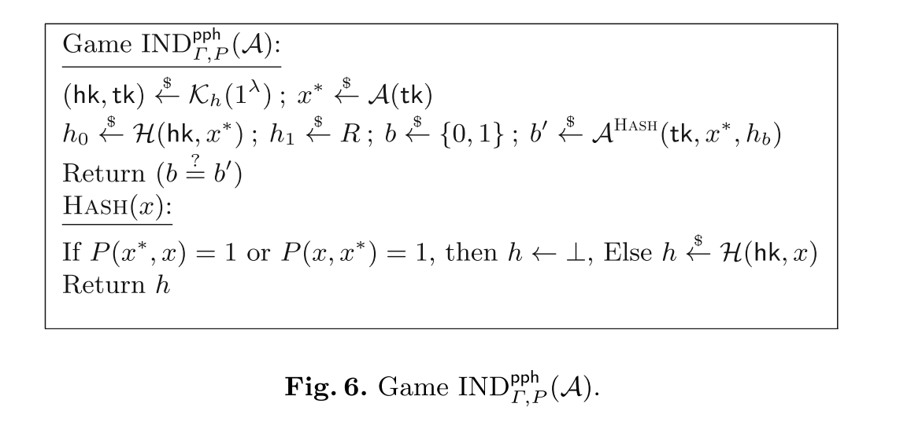

 ##  属性保持哈希PPH方案 $\Lambda = (\mathcal{K}_h, \mathcal{H}, \mathcal{T})$ 包含三个算法：
**密钥生成 ($\mathcal{K}_h$)：** 输入安全参数 $1^\lambda$，输出：
- 采样素数阶 $p$ 群 $\mathbb{G}, \hat{\mathbb{G}}, \mathbb{G}_T$，生成元 $g \in \mathbb{G}$, $\hat{g} \in \hat{\mathbb{G}}$，双线性映射 $e: \mathbb{G} \times \hat{\mathbb{G}} \rightarrow \mathbb{G}_T$。
- 随机选择 $k \leftarrow \{0,1\}^\lambda$。
- 设哈希密钥 $\mathbf{hk} = (k, g, \hat{g})$，测试密钥 $\mathbf{tk} = (\mathbb{G}, \hat{\mathbb{G}}, \mathbb{G}_T, e)$。

#### 双线性映射的三个特性：

1. 双线性性（Bilinearity）：对任意元素 $u \in G_1, v \in G_2$ 和整数 $a, b \in \mathbb{Z}_p$，满足： $e(u^a, v^b) = e(u, v)^{ab}$
2. 非退化性（Non-degeneracy）：存在元素 $g_1 \in G_1, g_2 \in G_2$，使得： $e(g_1, g_2) \neq 1$ 其中 $1$ 是目标群 $G_T$ 的单位元。 
3. 可计算性（Computability）：存在高效算法计算映射 $e(u, v)$ 的值。 

---
**哈希算法 ($\mathcal{H}$)：** 输入 $\mathbf{hk}$ 和 $x \in \{0,1\}^\lambda$：
- 随机选取非零元 $r_1, r_2 \in \mathbb{Z}_p$
- 输出哈希值,其中$F: \{0,1\}^\lambda \times \{0,1\}^\lambda \rightarrow \mathbb{Z}_p$ 是一个伪随机函数（PRF）：$\mathcal{H}(\mathbf{hk}, x) = \left( g^{r_1},\ g^{r_1 \cdot F(k,x)},\ \hat{g}^{r_2},\ \hat{g}^{r_2 \cdot F(k,x+1)} \right)$

**测试算法 ($\mathcal{T}$)**： 输入 $\mathbf{tk}$ 和两组哈希值 $(A_1, A_2, B_1, B_2)$, $(C_1, C_2, D_1, D_2)$：
- 当且仅当下式成立时输出 1：$e(A_1, D_2) = e(A_2, D_1)$
- 否则输出 0。

定义域与值域： 输入空间 $\mathcal{D} = \{0,1\}^\lambda$，输出空间 $\mathcal{R} = \mathbb{G}^2 \times \hat{\mathbb{G}}^2$.

---

$P(x, y)= 1(x = y + 1)$

---

### 核心性质总结

#### 1. 正确性（Correctness）

通过游戏 $\mathrm{COR}_{\Gamma,P}^{\mathrm{pph}}(\mathcal{A})$ 定义：

- 挑战者生成 $(hk,tk) \stackrel{\$}{\leftarrow} \mathcal{K}_h(1^\lambda)$，向敌手 $\mathcal{A}$泄露$tk$

- $\mathcal{A}$ 提交 $(x,y)$，挑战者计算 $h_x \stackrel{\$}{\leftarrow} \mathcal{H}(hk,x)$, $h_y \stackrel{\$}{\leftarrow} \mathcal{H}(hk,y)$

- 当且仅当 $\mathcal{T}(tk,h_x,h_y) \neq P(x,y)$ 时游戏输出 1

计算正确性要求：

$$\forall\ \text{高效}\ \mathcal{A},\quad \Pr\left[\mathrm{COR}_{\Gamma,P}^{\mathrm{pph}}(\mathcal{A})=1\right] \leq \mathsf{negl}(\lambda)$$

> 即敌手无法构造使测试结果 $T$ 与谓词 $P$ 不一致的输入对 $(x,y)$

---
#### 2. 安全性：受限选择输入安全（Restricted-Chosen-Input Security）

通过游戏 $\mathrm{IND}_{\Gamma,P}^{\mathrm{pph}}(\mathcal{A})$ 定义（图6）：

阶段1：挑战者生成 $(hk,tk) \stackrel{\$}{\leftarrow} \mathcal{K}_h(1^\lambda)$，敌手 $\mathcal{A}$选择挑战输入$x^*$
阶段2： 
- 计算真实哈希 $h_0 \stackrel{\$}{\leftarrow} \mathcal{H}(hk,x^)\quad$
- 生成随机值$h_1 \stackrel{\$}{\leftarrow} \mathcal{R}\quad$
- 随机选择$b \stackrel{\$}{\leftarrow} \{0,1\}$，向 $\mathcal{A}$发送$(x, h_b)$
- 敌手可查询 HASH 预言机，但禁止查询与 $x^*$ 满足 $P(x^*,x)=1$ 或 $P(x,x^*)=1$ 的 $x$
- $\mathcal{A}$ 输出 $b'$，游戏获胜当且仅当 $b'=b$

$$\boxed{ \operatorname{Adv}_{\Gamma,P,\mathcal{A}}^{\mathrm{pph}}(\lambda) = 2 \cdot \Pr\left[\mathrm{IND}_{\Gamma,P}^{\mathrm{pph}}(\mathcal{A})=1\right] - 1 }$$
$$\forall\ \text{高效}\ \mathcal{A},\quad \operatorname{Adv}_{\Gamma,P,\mathcal{A}}^{\mathrm{pph}}(\lambda) \leq \mathsf{negl}(\lambda)$$
---

#### 正确性

正确性可归约为验证 $F(k, y + 1) = F(k, x)$ 是否成立：

- 若 $x = y + 1$，等式恒成立；
- 否则，可严格证明：若敌手在未知密钥时能以不可忽略的概率找到满足该等式的 $(x, y)$，则其可构造一个与 $F$ 是伪随机函数（PRF） 假设相矛盾的攻击。

#### 安全性

在以下双重假设下，PPH（受限选择输入安全）方案可证安全：

1. $F$ 是 PRF；
2. 对称外部 Diffie-Hellman (SXDH) 假设 成立（定义如下）。

---
#### 定义 13 (SXDH 假设)

设 $\mathbb{G}, \hat{\mathbb{G}}, \mathbb{G}_T$ 为素数阶 $p$ 群，$g$ 与 $\hat{g}$ 分别为 $\mathbb{G}$ 和 $\hat{\mathbb{G}}$ 的生成元，$e: \mathbb{G} \times \hat{\mathbb{G}} \to \mathbb{G}_T$ 是双线性配对。称 SXDH 假设对上述群结构与配对成立，当且仅当对所有高效算法 $\mathcal{A}$：

$$\left| \Pr\left[\mathcal{A}(g, g^a, g^b, g^{ab}) = 1\right] - \Pr\left[\mathcal{A}(g, g^a, g^b, T) = 1\right] \right|$$

与

$$\left| \Pr\left[\mathcal{A}(\hat{g}, \hat{g}^a, \hat{g}^b, \hat{g}^{ab}) = 1\right] - \Pr\left[\mathcal{A}(\hat{g}, \hat{g}^a, \hat{g}^b, T) = 1\right] \right|$$

均为关于安全参数 $\lambda$ 的可忽略函数。其中：

- $a, b \xleftarrow{\$} \mathbb{Z}_p$（均匀随机选取）
- $T \xleftarrow{\$} \mathbb{G}_T$（均匀随机选取）

---

### 定理 14 

- **假设**：$F$ 是伪随机函数（PRF），且对称外部 Diffie-Hellman（SXDH）假设在对应的群结构与双线性配对中成立。 
- **结论**：我们的 PPH 方案 $\Gamma$ 满足受限选择输入安全性（restricted-chosen-input secure）。

---

### 证明过程

采用混合论证法（hybrid argument）。在真实游戏 $H_0 = \mathrm{IND}_{\Gamma,P}^{\text{pph}}(\mathcal{A})$ 中，敌手获得的挑战哈希值为 $(A_1, A_2, B_1, B_2) \in \mathbb{G}^2 \times \hat{\mathbb{G}}^2$。现定义以下混合实验（其中 $R \stackrel{\$}{\leftarrow} \mathbb{G}$与$\hat{R} \stackrel{\$}{\leftarrow} \hat{\mathbb{G}}$ 为独立均匀随机元素）：

1. 混合实验 $\boldsymbol{H_1}$

	- 初始化时，采样均匀随机函数 $F^* \stackrel{R}{\leftarrow} \text{Funs}[\{0,1\}^\lambda, \{0,1\}^\lambda]$ 替代 PRF 密钥 $K$
	- 其余流程与 $H_0$ 一致

2. 混合实验 $\boldsymbol{H_2}$： 挑战哈希值替换为 $(A_1, R, B_1, B_2)$（其中 $R$ 为 $\mathbb{G}$ 中随机元素）

3. 混合实验 $\boldsymbol{H_3}$：挑战哈希值替换为 $(A_1, R, B_1, \hat{R})$（其中 $\hat{R}$ 为 $\hat{\mathbb{G}}$ 中随机元素）

在 $H_3$ 中，敌手实际获得来自值域 $\mathcal{R}$ 的随机元组。由此可得敌手优势：
$$\boxed{ \operatorname{Adv}_{\Gamma,P,\mathcal{A}}^{\text{pph}}(\lambda) = \left| \Pr[H_0 = 1] - \Pr[H_3 = 1] \right| }$$

---
为证 $H_0$ 与 $H_3$ 计算不可区分（computational indistinguishability），需逐步证明相邻混合实验不可区分：

1. $\boldsymbol{H_0 \approx_c H_1}$：由 PRF 安全性直接保证（真实函数与随机函数不可区分）
2. $\boldsymbol{H_1 \approx_c H_2}$：待后续步骤基于 SXDH 假设证明（原文此处截断）

> 证明逻辑核心：通过构建 $H_0 \rightarrow H_1 \rightarrow H_2 \rightarrow H_3$ 的混合链，将 PPH 安全性归约至 ① PRF 安全 ② SXDH 假设。当 $H_3$ 输出纯随机值时，敌手优势应为 0，故初始优势可忽略。

---

### 引理15（Lemma 15）

核心命题 在 SXDH 假设下，混合实验 $H_1$ 与 $H_2$ 计算不可区分（$H_1 \approx H_2$）。

敌手设定

- $\mathcal{A}$：攻击 PPH 方案安全性的敌手
- $\epsilon = \left| \Pr[H_1=1] - \Pr[H_2=1] \right|$（$H_1$ 与 $H_2$ 的输出差异概率）

归约构造 可构造敌手 $\mathcal{B}$ 以 $\epsilon$ 优势破解 SXDH 问题。$\mathcal{B}$ 的操作流程如下：

---
1. 初始化

- 接收 SXDH 挑战 $(g, \hat{g}, B, C, T)$，其中 $B=g^b, C=g^c$
- 设置公共参数 $tk = (\mathbb{G}, \hat{\mathbb{G}}, \mathbb{G}_T, e)$ 并发送给 $\mathcal{A}$

2. 挑战阶段

- 接收 $\mathcal{A}$ 提交的挑战输入 $x^* \stackrel{\$}{\leftarrow} \mathcal{A}(tk)$
- 通过惰性采样（lazy sampling） 模拟随机函数 $F^*$，并隐式设定 $F^*(x^*) = b$（$b$ 是 $B$ 的离散对数）
- 生成挑战哈希值：

$$\begin{align*} A_1 &= g^c, \quad A_2 = T \\ B_1 &= \hat{g}^{r^*}, \quad B_2 = \hat{g}^{r^* \cdot F^*(x^*+1)} \quad (r^* \stackrel{\$}{\leftarrow} \mathbb{Z}_p) \end{align*}$$
---
3. 哈希查询应答

|     查询类型     |                                                 计算方式                                                 |
| :----------: | :--------------------------------------------------------------------------------------------------: |
| $x \neq x^*$ | $\mathcal{H}(x) = \left( g^{r_1},\ g^{r_1 F^*(x)},\ \hat{g}^{r_2},\ \hat{g}^{r_2 F^*(x+1)} \right)$  |
|  $x = x^*$   | $\mathcal{H}(x^*) = \left( g^{r_1'},\ B^{r_1'},\ \hat{g}^{r_2'},\ \hat{g}^{r_2' F^*(x^*+1)} \right)$ |

---

### 引理16（Lemma 16）:在 SXDH 假设下，$H_2 \approx H_3$ 成立。

- 与引理15的证明完全对称，但将操作迁移至群 $\hat{\mathbb{G}}$ 上
- 核心步骤：将 $B_2$ 分量中的 $\hat{g}^{r^* F^*(x^*+1)}$ 替换为随机元素 $\hat{R}$
- 证明省略原因：技术细节与引理15完全镜像（仅需交换 $\mathbb{G}$ 与 $\hat{\mathbb{G}}$ 角色）
### 联合证明架构总结

| 环节          | 技术目标         | 依赖假设                     | 核心操作                                       |
| ----------- | ------------ | ------------------------ | ------------------------------------------ |
| $H_0 → H_1$ | 真实PRF → 随机函数 | PRF 安全                   | 用 $F^*$ 替代密钥 $k$                           |
| $H_1 → H_2$ | $A_2$ 分量随机化  | SXDH（$\mathbb{G}$）       | 将 $g^{c \cdot F^*(x^*)}$ 替换为 $T$           |
| $H_2 → H_3$ | $B_2$ 分量随机化  | SXDH（$\hat{\mathbb{G}}$） | 将 $\hat{g}^{r^* F^*(x^*+1)}$ 替换为 $\hat{R}$ |

---